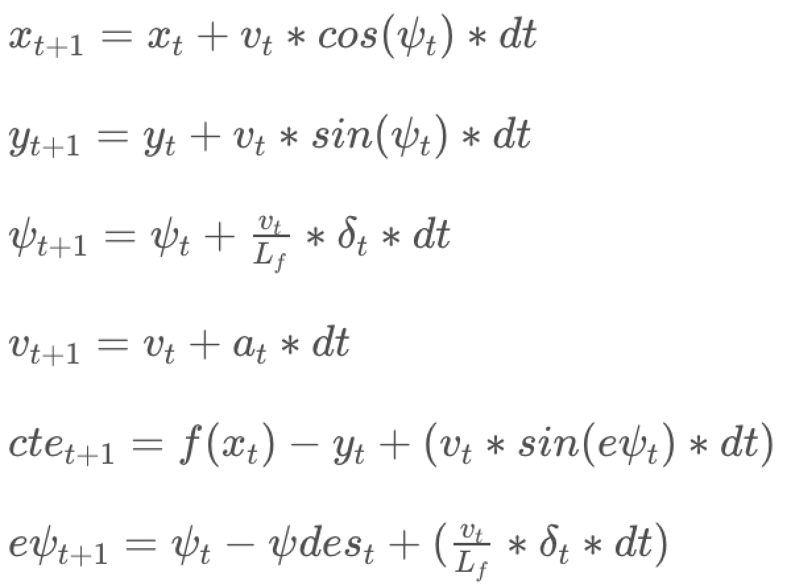

# Autonomous driving with Model Predictive Control

The goal of the project is to use Model Predictive Control (MPC) to autonomously drive a car in a simulated environment around a given track. The project implements a MPC to predict actuator inputs for following a trajectory. IPOPT and CPPAD is used for running the optimization procedure. The optimization is minimization of the cost function that keeps the car within the track as well as ensures a smooth drive.

# Rubric
## The Model
The kinematic model is the same as that from the classes. The state consists of:
 1. X position
 2. Y position
 3. Heading angle
 4. Speed
 5. Cross track error
 6. Heading error

Actuators include:
 1. Throttle
 2. Steering angle

Update Equations:

## Timestep Length and Elapsed Duration
Timestep length (N) = 10 and elapsed duration (dt) = 0.1

Choice of N and dt is a trade off between how far in future the prediction is required and the computation required. With the computing power of my laptop, it was reasonable to predict 1 second into the future. Other values tried were: N = 25, dt = 0.05.

## Polynomial Fitting and MPC Preprocessing
A 3 degree polynomial is fit to the waypoints. The way points are first tranformed to the car co-ordinates before passing it to MPC for optimization.

## Model Predictive Control with Latency
The crux of this problem is to define the cost function to be minimized. The actuator values that minimizes the cost function is used as the input actuator values. Cost function includes cross-track-error, heading error, penalty for use of high actuator values and penalty for sudden change in actuator values. With this cost function and no latenccy, MPC was able to come up with good actuator values to drive the car around. With 100 millisecond latency, it was a little challenging. To incorporate the latency into optimization, MPC was input the state resulting from a latency of 100 milliseconds. The vehicle kinematic model is used to estimate the state after 100 milliseconds and this is used as the initial state for MPC. Additionally to be able to drive at high speeds, it was necessary to slow down around sparp turns. To achieve this the cost function was modified to incorporate a throttle penalty when steering angle is high.

## Simulation
With the above model, MPC generates actuator control values to keep the car within the track at 86mph while ensuring a smooth drive.
